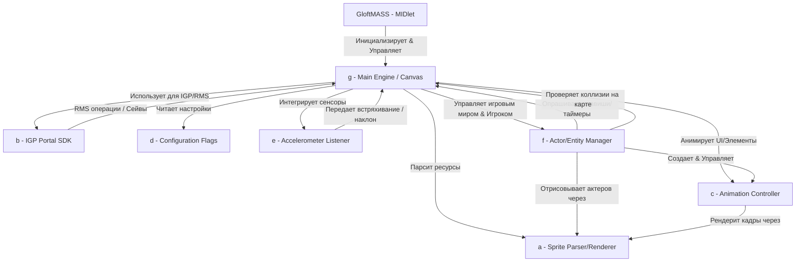

# Карта зависимостей классов (Class Dependency Map)

Диаграмма взаимодействия классов в оригинальной J2ME-игре **Zombie Infection**:



## Текстовая карта зависимостей

```
GloftMASS (MIDlet)
  ↓
g (Основной игровой движок / Canvas)
  ├── f (Контроллер персонажей и сущностей / Actor Manager)
  │    ├── c (Анимационный контроллер спрайта / Animation Instance)
  │    │    └── a (Загрузчик и отрисовщик листов спрайтов / Sprite Sheet Engine)
  │    └── g (Обратная связь: чтение сетки карты, коллизии, ввод, таймеры)
  ├── c (Анимационный контроллер интерфейса и окружения)
  │    └── a (Отрисовка спрайтов интерфейса)
  ├── e (Контроллер акселерометра / Управление наклоном)
  ├── b (Мо monetization-портал IGP / Менеджер сохранений RMS)
  └── d (Глобальные флаги конфигурации билда)
```
